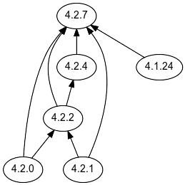

This playbook helps to mirror OpenShift repository into your local copy. 

`oc` command should be in your `$PATH`.

You will need to define the following variables

| Name | Description |
| -- | -- |
| ocp_release | OpenShift version | 
| local_registry |  Your local repository. For example: my-registry.example.com:5000 |local_repository | The local repository for the mirror | 
|local_registry_insecure | Whether to use insure mode(http) to connect to the local repository |
| registry_auth | Registries token. This is kept in vault.yml | 

You will need the authentication token from your local registry. Tokens from quay.io and registry.redhat.io can be taken from [cloud.redhat.com](https://cloud.redhat.com) pull secret. 

```
registry_auth:
   auths:
     my-registry.example.com:5000: 
       auth: XXX
     registry.redhat.io:
       auth: XXX
     quay.io:
       auth: XXX
```

### OpenShift version

To mirror a version for upgrading, refer to this [article](https://access.redhat.com/solutions/4583231).

Alternatively, you can run this
`$ curl -sH 'Accept:application/json' 'https://api.openshift.com/api/upgrades_info/v1/graph?channel=stable-4.2' | ./graph.sh | dot -Tsvg | magick - /tmp/graph.png`



graph.sh is available [here](https://github.com/openshift/cincinnati/blob/master/hack/graph.sh)

dot is from Graphviz

magick is from ImageMagick

### OpenShift Upgrade

`oc adm upgrade --to-image {local_registry}/{local_repository}:{ocp_release}`

Example:
`oc adm upgrade --to-image ocp4-registry.ocp.ltsai.com:5000/ocp4/openshift:4.2.7`

